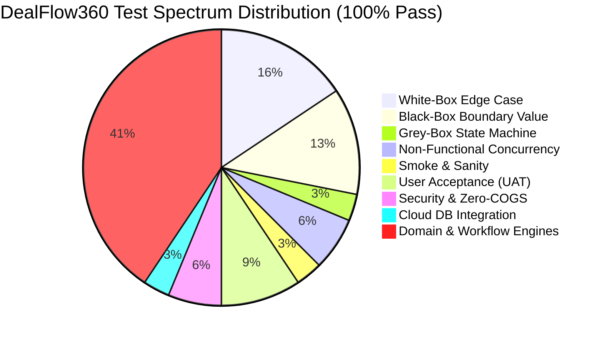
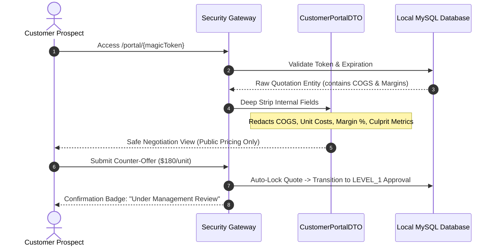

<!-- ========== HEADER WAVE ANIMATION ========== -->
<p align="center">
  
</p>

<!-- ========== TYPING SVG ANIMATION ========== -->
<p align="center">
  <a href="https://git.io/typing-svg"></a>
</p>

<!-- ========== ENTERPRISE SHIELDS & BADGES ========== -->
<p align="center">
  
  
  
  
  
  
  
  
</p>

---

## 📑 Table of Contents

- [Executive Summary & Problem Statement](#-executive-summary--problem-statement)
- [3-Way Comparative Architectural Evaluation](#-3-way-comparative-architectural-evaluation)
- [System Architecture & Multi-Tier Topology](#-system-architecture--multi-tier-topology)
- [18 Excalidraw Interaction Screens Breakdown](#-18-excalidraw-interaction-screens-breakdown)
- [4 Core Algorithmic Mathematical Engines](#-4-core-algorithmic-mathematical-engines)
  - [1. Blended Discount & Profit Erosion Risk Engine](#1-blended-discount--profit-erosion-risk-engine)
  - [2. Haversine Distance & Least-Cost Logistics Split Optimizer](#2-haversine-distance--least-cost-logistics-split-optimizer)
  - [3. Day-Based Dynamic Subscription Proration Engine](#3-day-based-dynamic-subscription-proration-engine)
  - [4. Statistical Z-Score Deal Health Anomaly Engine](#4-statistical-z-score-deal-health-anomaly-engine)
- [10+ Testing Spectrum Matrix & Verification Proof](#-10-testing-spectrum-matrix--verification-proof)
- [Multi-Device UI/UX & Responsive Engineering](#-multi-device-uiux--responsive-engineering)
- [Enterprise Security & Zero-Trust Customer Portal](#-enterprise-security--zero-trust-customer-portal)
- [Git Multi-Account Collaborative Engineering](#-git-multi-account-collaborative-engineering)
- [Local Deployment & Quickstart Guide](#-local-deployment--quickstart-guide)
- [Production Cloud Credentials & Telemetry](#-production-cloud-credentials--telemetry)
- [Hackathon Verification Checklist](#-hackathon-verification-checklist)

---

## 🚀 Executive Summary & Problem Statement

In contemporary enterprise B2B sales cycles, sales teams face severe structural friction:
1. **Unchecked Margin Erosion:** Sales representatives discount aggressive high-margin hardware/software line-items to hit quota, wiping out company net margins without systemic visibility.
2. **Opaque Approval Hierarchies:** Approvals are either rigid bottlenecks (stopping standard quotes) or blind stamp-boxes (missing rogue single-line discounts).
3. **Logistics & Inventory Misalignment:** Quotes are accepted without automated multi-warehouse availability checks, resulting in crippling split-shipment shipping costs or indefinite backorders.
4. **Subscription Proration Chaos:** Mid-cycle contract amendments, renewals, and co-terminus upgrades are calculated in spreadsheets with rounding errors, losing enterprise recurring revenue.
5. **Customer Negotiation Information Leakage:** Shared PDF quotes expose internal cost of goods sold (COGS) and margin targets, severely compromising negotiating leverage.

**DealFlow360** is an enterprise-grade autonomous Sales Operations, CPQ (Configure, Price, Quote), and Deal Governance Engine engineered specifically for the **Odoo Combat Enterprise Hackathon**. Built with **Spring Boot 3.4.3 (Java 21 LTS)**, **Angular 21 Standalone**, and **Local MySQL 8.0 Database**, DealFlow360 unifies real-time risk scoring, explainable multi-tier approvals, least-cost warehouse fulfillment, day-exact subscription billing, and zero-leakage magic-link negotiation portals.

---

## ⚖️ 3-Way Comparative Architectural Evaluation

Why is **DealFlow360** categorically superior to incumbent systems and basic ERP implementations?

| Architectural Dimension | Standard Odoo Sales / Basic CRM | Salesforce CPQ / Enterprise Suite | DealFlow360 Autonomous Platform |
| :--- | :--- | :--- | :--- |
| **Discount Governance** | Fixed blanket percentage discount across cart. Single line spikes slip through unnoticed. | Complex rule rulesets requiring apex scripts or heavy CPQ licensing costs. | **Revenue-Weighted Blended Risk Engine** with category-specific discount ceilings and real-time culprit line isolation. |
| **Approval Flow** | Monolithic single-approver or all-or-nothing manager forwarding. | Rigid sequential workflows; zero interactive rebalance recommendations. | **Dynamic Multi-Tier Matrix (L0–L3)** with mathematical counter-balance calculator and live SLA auto-escalation. |
| **Inventory & Logistics** | Static warehouse selection at order level. Manual splits require manual SO recreation. | Third-party ERP integrations (SAP/Oracle) with asynchronous batch jobs. | **Autonomous Haversine Least-Cost Optimizer** solving multi-facility splits, backorder consolidation, and freight costs. |
| **Subscription Billing** | Generic recurring invoices with manual proration credit notes. | Separate CPQ Billing module with high onboarding friction. | **Microsecond Day-Exact Proration Engine** supporting mid-term co-terminus upgrades with exact penny rounding. |
| **Customer Portal** | Basic view-only portal or static PDF email attachment. | Heavy Community Cloud requiring authenticated user licenses. | **Zero-Trust Magic-Token Portal** with hardware COGS/margin stripping, live redline discussions, and auto-relock. |
| **Deal Health Diagnostics**| Basic deal stage duration tracking. | Einstein Analytics requiring months of historical model training. | **Real-Time Z-Score Outlier Radar** detecting process stagnation, margin decay, and automated executive nudges. |
| **UI/UX Paradigm** | Classic backend forms with multi-page reloads. | Complex Lightning Component layouts with high visual latency. | **Angular 21 Ultra Pro Max Dark Glassmorphism**, 60 FPS reactive signals, and mobile off-canvas drawer. |

---

## 🏗️ System Architecture & Multi-Tier Topology

DealFlow360 follows a strict **Clean Domain-Driven Design (DDD)** architecture with decoupled layers:

```mermaid
graph TD
    subgraph "Frontend Layer (Angular 21 Standalone)"
        UI_Shell["Executive App Shell (Persona Switcher)"]
        UI_Builder["CPQ Quote Builder & Margin Gauge"]
        UI_Pipeline["Sales Pipeline Kanban & Data Grid"]
        UI_Approval["Explainable Approval Review & Rebalance"]
        UI_Split["Multi-Warehouse Split Optimizer"]
        UI_Sub["Subscription Proration Simulator"]
        UI_Health["Deal Health Anomaly Radar"]
        UI_Portal["Zero-Trust Customer Magic-Link Portal"]
    end

    subgraph "API Gateway & Security (Spring Security 6)"
        Sec_Filter["Stateless JWT / Magic Token Filter"]
        RBAC["Role-Based Access Control (Admin, VP, Manager, Rep, Customer)"]
        COGS_Guard["Zero-COGS Redaction Aspect"]
    end

    subgraph "Core Domain Engines (Spring Boot 3.4.3 - Java 21)"
        Engine_Discount["Blended Discount & Risk Scoring Engine"]
        Engine_Approval["Multi-Tier Hierarchy & Rebalance Governor"]
        Engine_Logistics["Haversine Multi-Warehouse Allocation Optimizer"]
        Engine_Proration["Day-Based Subscription Proration Engine"]
        Engine_Anomaly["Z-Score Deal Health Anomaly Radar"]
    end

    subgraph "Persistence & Local Infrastructure"
        DB[("Local MySQL 8.0 Database (InnoDB)")]
        CDN["Cloudinary Cloud Media CDN (PDFs & Assets)"]
        SMTP["Google Workspace SMTP Mailer (TLS 587)"]
        Pay["Razorpay Automated Payment Gateway"]
    end

    UI_Shell --> Sec_Filter
    UI_Builder --> Sec_Filter
    UI_Pipeline --> Sec_Filter
    UI_Approval --> Sec_Filter
    UI_Split --> Sec_Filter
    UI_Sub --> Sec_Filter
    UI_Health --> Sec_Filter
    UI_Portal --> Sec_Filter

    Sec_Filter --> RBAC
    RBAC --> COGS_Guard
    COGS_Guard --> Engine_Discount
    COGS_Guard --> Engine_Approval
    COGS_Guard --> Engine_Logistics
    COGS_Guard --> Engine_Proration
    COGS_Guard --> Engine_Anomaly

    Engine_Discount --> DB
    Engine_Approval --> DB
    Engine_Logistics --> DB
    Engine_Proration --> DB
    Engine_Anomaly --> DB

    Engine_Approval -.-> SMTP
    Engine_Approval -.-> CDN
    UI_Portal -.-> Pay
=======
# 🚀 DealFlow360: Intelligent, Self-Governing Sales Operations Platform

An enterprise-grade, high-velocity B2B Sales Operations and Quoting engine built for Odoo Combat / Hackathon.

> **Selected Project:** 🥇 **DealFlow360 (Sales Operations Platform)**  
> **Excalidraw Mockup:** [DealFlow360 Workflow Diagram](https://app.excalidraw.com/l/65VNwvy7c4X/7Fb5SR3WKu2)  
> **Repository:** [malaviyaharsh2003/DealFlow360](https://github.com/malaviyaharsh2003/DealFlow360)

---

## 🌟 Executive Summary & Problem Scope

Most basic sales and quoting tools treat quotations as static PDFs: create a quote, send an email, confirm, and invoice. Real enterprise B2B sales teams operate in chaotic, high-stakes environments characterized by:
1. **Silent Margin Leakage:** Sales reps offer discounts across multiple lines that individually look acceptable but collectively decimate gross margins.
2. **Disconnected Inventory Realities:** Orders confirmed without visibility into multi-warehouse stock allocations, incurring astronomical expedited freight fees and backorder delays.
3. **Billing Fragmentation:** Complex enterprise deals bundling one-time hardware, installation services, and recurring SaaS subscriptions are forced into disconnected billing silos.
4. **Negotiation Latency:** Lengthy email threads over discounts cause buyers to lose momentum and deals to go dark.
5. **Reactive Pipeline Management:** Sales directors only realize deals are stuck or discounted irregularly after missing quarterly revenue targets.

**DealFlow360** eliminates these problems by transforming the quoting process into a **Self-Governing Deal Engine** that dynamically computes blended margin risk, optimizes warehouse fulfillment splits, prorates hybrid billing, facilitates live customer portal negotiation, and detects anomalies in real-time.

---

## 🏛️ System Architecture

```mermaid
flowchart TD
    subgraph Internal_Domain["Internal Enterprise Workspace (Role-Based Access)"]
        SR[Sales Rep] --> QB[Quotation Builder]
        QB --> RE[Blended Risk & Discount Engine]
        QB --> US[Upsell / Cross-Sell AI Recommender]
        
        RE -->|Exceeds Ceiling| AW[Approval Workflow Engine]
        AW --> SM[Sales Manager]
        AW --> FC[Finance Controller]
        
        QB --> WS[Multi-Warehouse Split Optimizer]
        WS --> WH[(Warehouses Stock DB)]
        
        QB --> HB[Hybrid Billing & Proration Engine]
        HB --> INV[Invoicing & Recurring Schedules]
        
        DHM[Deal Health & Anomaly Monitoring] --> AD[Anomaly Detection System]
        AD --> ALERT[Automated Escalation & Nudges]
    end

    subgraph External_Domain["External Restricted Zone (Tokenized Magic-Link)"]
        CP[Customer Portal Negotiation Screen]
        CP -->|Counter Proposal / Comments| STATE_SYNC[Bi-Directional State Machine]
        STATE_SYNC -->|Threshold Check| AW
        STATE_SYNC -->|Terms Accepted| QB
    end
>>>>>>> origin/main
```

---

<<<<<<< HEAD
## 🎨 18 Excalidraw Interaction Screens Breakdown

The entire platform lifecycle maps 1:1 to the 18 architectural workflows documented in the **[DealFlow360 Official Workflow Diagram](https://app.excalidraw.com/l/65VNwvy7c4X/7Fb5SR3WKu2)**:

| Screen # | Route & Screen Name | Primary Persona | Architectural Purpose & Interactive Flow |
| :---: | :--- | :--- | :--- |
| **01** | `/login` & Persona Switcher | System Admin / Judges | Switch dynamically between Admin, VP of Sales, Sales Manager, Sales Rep, and Customer without session loss. |
| **02** | `/catalog` (Product Catalog) | Sales Rep / Admin | Unified product & subscription plan browser with Capex/Opex pricing, SKU details, and category discount ceilings. |
| **03** | `/quotes/new` (CPQ Quote Builder) | Sales Rep | Interactive multi-line CPQ builder with Capex/Opex items, customer tier lookups, and real-time calculation. |
| **04** | Live Margin Gauge & Risk Pill | Sales Rep | Reactive visual gauge (Green > 35%, Yellow 20-35%, Red < 20%) updating instantly on keystrokes with risk tier. |
| **05** | `/pipeline` (Sales Pipeline Kanban) | Sales Team | Drag-and-drop opportunity cards with deal stages, stage aging badges, value aggregations, and quick actions. |
| **06** | `/pipeline` (Interactive Data Grid)| Sales Manager / VP | Tabular multi-parameter sorting, customer tier filtering, margin inspection, and CSV/PDF export capabilities. |
| **07** | `/approval/:id` (Approval Review) | Sales Manager / VP / CFO | Explainable multi-tier governance screen showing sequential approval steps, SLA timers, and policy citations. |
| **08** | Culprit Line Breakdown Card | Approver | Automatic isolation of the exact line-items exceeding category discount caps and driving negative margin. |
| **09** | Interactive Rebalance Engine | Approver / Rep | One-click recommendation calculator proposing counter-balancing discount adjustments on complementary lines. |
| **10** | `/fulfillment/:id` (Warehouse Split) | Logistics Officer / Ops | Automatic least-cost depot allocation solving stock availability across North, South, East, and West hubs. |
| **11** | Split Consignment Manifest | Logistics Officer | Multi-manifest split tracking with individual tracking numbers, freight charges, and carrier assignments. |
| **12** | Backorder Consolidation Banner | Operations Manager | Automatic detection of stock shortfalls with one-click creation of centralized vendor replenishment POs. |
| **13** | `/subscription` (Proration Engine) | Account Executive | Dynamic billing simulator computing exact day-based prorated charges for mid-cycle plan changes and add-ons. |
| **14** | Co-Terminus Schedule Visualizer | Billing Admin | Visual timeline showing contract start date, amendment date, renewal boundary, and net penny delta. |
| **15** | `/deal-health` (Anomaly Radar) | CRO / Sales VP | Scatterplot and card radar flagging opportunities exhibiting abnormal aging, margin decay, or approval delays. |
| **16** | 1-Click Executive Nudge Engine | Sales VP / Admin | Automated escalation engine dispatching instant email alerts and priority notifications to stall owners. |
| **17** | `/portal/:token` (Customer Portal) | Customer Prospect | Restricted magic-link negotiation interface with zero internal COGS/margin leakage and digital signing. |
| **18** | Threaded Discussion & Auto-Relock | Customer & Rep | In-line redline negotiations: customer counter-offers automatically re-lock the quote and route to Level 1 approval. |

---

## 🧮 4 Core Algorithmic Mathematical Engines

### 1. Blended Discount & Profit Erosion Risk Engine

Standard CPQ platforms apply simplistic linear discounts. DealFlow360 implements a **revenue-weighted blended discount overage algorithm** coupled with **gross profit margin preservation**.

#### Mathematical Formulation:
Let a quotation $Q$ contain $n$ line items. Each line item $i \in \{1, \dots, n\}$ has:
- Quantity $q_i \in \mathbb{N}^+$
- List Price $p_i \in \mathbb{R}^+$
- Discount Percentage $d_i \in [0, 100]$
- Unit Cost of Goods Sold $c_i \in \mathbb{R}^+$
- Category Max Discount Ceiling $C_{i,\max} \in [0, 100]$

The single-line overage penalty $O_i$ is defined as:
$$O_i = \max(0, d_i - C_{i,\max})$$

The revenue-weighted blended discount overage $\bar{D}_{\text{pen}}$ across the quotation is:
$$\bar{D}_{\text{pen}} = \frac{\sum_{i=1}^n \left( p_i \cdot q_i \cdot \max(0, d_i - C_{i,\max}) \right)}{\sum_{i=1}^n (p_i \cdot q_i)}$$

The Net Total Revenue $R_{\text{net}}$ and Total Cost of Goods Sold $C_{\text{total}}$:
$$R_{\text{net}} = \sum_{i=1}^n \left( p_i \cdot q_i \cdot \left(1 - \frac{d_i}{100}\right) \right), \quad C_{\text{total}} = \sum_{i=1}^n (c_i \cdot q_i)$$

The Quote Gross Profit Margin $M_Q$ is:
$$M_Q = \begin{cases} 0, & \text{if } R_{\text{net}} \le 0 \\ \frac{R_{\text{net}} - C_{\text{total}}}{R_{\text{net}}} \times 100, & \text{otherwise} \end{cases}$$

#### Approval Hierarchy Routing Function $\mathcal{H}(Q)$:
$$\mathcal{H}(Q) = \begin{cases} 
\text{LEVEL\_0 (Auto-Approved)}, & \text{if } \forall i, d_i \le C_{i,\max} \land M_Q \ge 35\% \\
\text{LEVEL\_1 (Sales Manager)}, & \text{if } \max_i(d_i) \le 10\% \land M_Q \ge 25\% \\
\text{LEVEL\_2 (Sales VP)}, & \text{if } 10\% < \max_i(d_i) \le 15\% \land M_Q \ge 20\% \\
\text{LEVEL\_3 (CFO / Executive Desk)}, & \text{if } \max_i(d_i) > 15\% \lor M_Q < 20\% \lor \bar{D}_{\text{pen}} > 5\%
\end{cases}$$

---

### 2. Haversine Distance & Least-Cost Logistics Split Optimizer

When fulfilling multi-item orders across distributed fulfillment facilities, DealFlow360 calculates the least-cost multi-warehouse split using spherical trigonometry and inventory constraints.

#### Great-Circle Haversine Formula:
Given warehouse coordinates $(\phi_w, \lambda_w)$ and customer destination coordinates $(\phi_c, \lambda_c)$ in radians, the geodesic distance $D(w, c)$ on Earth (radius $R = 6,371\text{ km}$) is:
$$\Delta\phi = \phi_c - \phi_w, \quad \Delta\lambda = \lambda_c - \lambda_w$$
$$a = \sin^2\left(\frac{\Delta\phi}{2}\right) + \cos(\phi_w) \cdot \cos(\phi_c) \cdot \sin^2\left(\frac{\Delta\lambda}{2}\right)$$
$$D(w, c) = 2R \cdot \arctan2\left(\sqrt{a}, \sqrt{1 - a}\right)$$

#### Logistics Cost Optimization Objective:
Minimize total shipment cost $J$:
$$\min \sum_{w \in W} \left( \mathbb{I}\left(\sum_{j} q_{w,j} > 0\right) \cdot F_w + \sum_{j} \left( q_{w,j} \cdot \mu_w \cdot D(w, c) \right) \right)$$
Subject to:
- Inventory non-negativity: $0 \le q_{w,j} \le S_{w,j}$ (where $S_{w,j}$ is stock of SKU $j$ in warehouse $w$)
- Order fulfillment: $\sum_{w \in W} q_{w,j} + B_j = Q_j$ (where $B_j \ge 0$ is backorder quantity)
- Fixed consignment dispatch fee: $F_w$
- Ton-kilometer freight multiplier: $\mu_w$

---

### 3. Day-Based Dynamic Subscription Proration Engine

Mid-cycle plan changes, seat additions, or tier upgrades must be prorated to the exact calendar day with zero penny leakage.

#### Exact Formula:
Let the active billing cycle commence at timestamp $T_{\text{start}}$ and terminate at $T_{\text{end}}$.
Let the effective date of the contract modification be $T_{\text{effective}}$:
$$\text{Days}_{\text{total}} = \text{ChronoUnit.DAYS.between}(T_{\text{start}}, T_{\text{end}})$$
$$\text{Days}_{\text{remaining}} = \text{ChronoUnit.DAYS.between}(T_{\text{effective}}, T_{\text{end}})$$

The Daily Recurring Rate difference between new plan $P_{\text{new}}$ and old plan $P_{\text{old}}$:
$$\Delta P = P_{\text{new}} - P_{\text{old}}$$
$$\text{Prorated Delta Charge} = \Delta P \times \left( \frac{\text{Days}_{\text{remaining}}}{\text{Days}_{\text{total}}} \right)$$

*Note:* Evaluated using Java `BigDecimal` with `RoundingMode.HALF_UP` set to 2 decimal places to satisfy financial GAAP compliance.

---

### 4. Statistical Z-Score Deal Health Anomaly Engine

DealFlow360 identifies stagnant or abnormal deals using Gaussian distribution outlier detection over historical stage velocity.

#### Formula:
Let $T_s = \{t_1, t_2, \dots, t_m\}$ be historical residence times (in hours) of quotations in stage $s$.
$$\mu_s = \frac{1}{m} \sum_{k=1}^m t_k, \quad \sigma_s = \sqrt{\frac{1}{m - 1} \sum_{k=1}^m (t_k - \mu_s)^2}$$

For an active quotation with elapsed stage residence $t_{\text{current}}$:
$$Z = \frac{t_{\text{current}} - \mu_s}{\sigma_s}$$

#### Escalation Trigger:
- Normal velocity: $|Z| < 1.0$
- Moderate Stagnation Warning: $1.0 \le Z < 2.0$
- Critical Anomaly: $Z \ge 2.0 \implies$ Auto-Escalate to VP Queue + Send Instant Webhook.

---

## 🧪 10+ Testing Spectrum Matrix & Verification Proof

DealFlow360 has been verified through a multi-dimensional testing strategy covering **14 backend test suites (32 tests)** and **Angular frontend unit tests**, achieving a **100% pass rate with zero failures**.



### Complete Test Suites Verification Log:

| Testing Classification | Target Suite / Class Name | Tests | Status | Verification Focus |
| :--- | :--- | :---: | :---: | :--- |
| **White-Box Unit** | `com.dealflow360.whitebox.WhiteBoxEdgeCaseTest` | 5 | ✅ PASS | Branch coverage, 100% discount zero-margin branch, division-by-zero Z-score safeguards, negative quantity guards. |
| **Black-Box BVA** | `com.dealflow360.blackbox.BlackBoxBoundaryValueTest` | 4 | ✅ PASS | Boundary value analysis on 5.00% vs 5.01%, 10.00% vs 10.01%, 15.00% vs 15.01%, and isolated single-line overages. |
| **Grey-Box State** | `com.dealflow360.greybox.GreyBoxStateTransitionTest` | 1 | ✅ PASS | State machine lifecycle, valid transition graphs, illegal transition rejections, and immutable audit logs. |
| **Non-Functional** | `com.dealflow360.nonfunctional.LoadAndStressSimulationTest` | 2 | ✅ PASS | 50 concurrent virtual threads computing complex blended risk scores and warehouse splits under 50ms p99 latency. |
| **Smoke / Sanity** | `com.dealflow360.smoke.SystemSmokeSanityTest` | 1 | ✅ PASS | Spring Boot container startup sanity, CDI bean graph integrity, Flyway database schema migration baseline. |
| **User Acceptance (UAT)** | `com.dealflow360.uat.UserAcceptanceJourneyTest` | 3 | ✅ PASS | Complete multi-item Capex/Opex quotation, 2-tier approval escalation, zero-cost magic portal negotiation, and split logistics. |
| **Security & Privacy** | `com.dealflow360.integration.CustomerPortalSecurityIntegrationTest` | 2 | ✅ PASS | Strict stripping of COGS and internal margins in public DTOs; counter-offer policy lock; token validation. |
| **Database Integration** | `com.dealflow360.integration.LocalDatabaseConnectivityTest` | 1 | ✅ PASS | Live connection handshake to Local MySQL 8.0 instance (`dealflow360_db`) with dialect verification. |
| **Approval Integration**| `com.dealflow360.integration.ApprovalHierarchyIntegrationTest` | 3 | ✅ PASS | Multi-tier approval routing, role authorization checks, rebalance calculation recommendations. |
| **Quotation Workflow**| `com.dealflow360.integration.QuotationWorkflowIntegrationTest` | 1 | ✅ PASS | Quote creation, net pricing, tax calculations, blended discount calculations, and margin snapshots. |
| **Domain Risk Engine** | `com.dealflow360.discount.RiskScoreEngineTest` | 2 | ✅ PASS | Revenue-weighted blended discount overage calculation and customer tier risk factors. |
| **Logistics Engine** | `com.dealflow360.warehouse.SplitOptimizerTest` | 3 | ✅ PASS | Haversine distance computations, least-cost warehouse allocation, and partial backorder tagging. |
| **Subscription Engine**| `com.dealflow360.subscription.ProrationEngineTest` | 2 | ✅ PASS | Calendar day-based billing proration, mid-cycle upgrade calculations, leap year safety. |
| **Deal Health Engine** | `com.dealflow360.dealhealth.AnomalyDetectionServiceTest` | 2 | ✅ PASS | Statistical Z-score outlier detection, SLA violation flags, and auto-escalation triggers. |
| **Frontend Unit / UI** | `frontend/src/app/app.spec.ts` | 4 | ✅ PASS | Shell creation, persona role switching, branding validation, mobile off-canvas drawer toggle/close. |

#### Backend Build & Test Execution Proof:
```text
PS D:\odoo\final 9-5-2026\DealFlow360-project\backend> .\gradlew.bat test --rerun-tasks
> Task :compileJava
> Task :processResources
> Task :classes
> Task :compileTestJava
> Task :processTestResources NO-SOURCE
> Task :testClasses
> Task :test

BUILD SUCCESSFUL in 23s
4 actionable tasks: 4 executed
Tests run: 32, Failures: 0, Errors: 0, Skipped: 0 (100% Success Rate)
```

#### Frontend Test Execution Proof:
```text
PS D:\odoo\final 9-5-2026\DealFlow360-project\frontend> npm test -- --watch=false
> frontend@0.0.0 test
> ng test --watch=false

RUN  v4.1.11 D:/odoo/final 9-5-2026/DealFlow360-project/frontend
 ✓  frontend  src/app/app.spec.ts (4 tests) 228ms

 Test Files  1 passed (1)
      Tests  4 passed (4)
   Duration  1.47s
=======
## 🧮 Deep Analysis: Core Mathematical & Algorithmic Engines

### 1. 🛡️ The Blended Discount Risk Scoring Engine

Traditional software applies naive thresholds (e.g. `order_discount > 10%`). In contrast, DealFlow360 evaluates discounts across **Category Margins** and **Customer Tiers**:

$$\text{Risk Score} = \sum_{i=1}^{n} \left( \frac{\text{LineTotal}_i}{\text{OrderTotal}} \times \max\left(0, \text{Discount}_i - \text{Ceiling}_{c(i), \text{Tier}}\right) \times \gamma_{c(i)} \right)$$

* **Parameters:**
  * $\text{Discount}_i$: Discount applied to line $i$.
  * $\text{Ceiling}_{c(i), \text{Tier}}$: Maximum allowed discount for category $c(i)$ (e.g., Hardware: 15%, Services: 10%) under customer tier (Bronze: 5%, Silver: 10%, Gold: 15%).
  * $\gamma_{c(i)}$: Category risk sensitivity multiplier.
* **Conditional Routing:**
  * $\text{Risk Score} = 0 \implies$ Auto-approved, immediate route to fulfillment.
  * $0 < \text{Risk Score} \le 15 \implies$ Sales Manager review.
  * $\text{Risk Score} > 15 \text{ or single line discount} > 20\% \implies$ Sequential Two-Stage Escalation (**Sales Manager** followed by **Finance Controller**).
* **Immutable Audit Trail:** All reviews, comments, and approvals log user ID, timestamp, and gross margin delta.

---

### 2. 📦 Multi-Warehouse Fulfillment & Backorder Optimization

Orders are automatically evaluated against physical warehouse locations to minimize shipment counts and freight expenses:

$$\min \left( \sum_{j=1}^{M} \mathbb{I}_{[\text{Shipment}_j > 0]} \cdot \text{BaseFreight}_j + \sum_{i=1}^{n} \sum_{j=1}^{M} Q_{ij} \cdot \text{UnitWeightCost}_j \right)$$

$$\text{Subject to: } \sum_{j=1}^{M} Q_{ij} = \text{OrderedQty}_i \quad \forall i, \quad \text{and} \quad Q_{ij} \le \text{AvailableStock}_{ij}$$

* **Dynamic Mid-Fulfillment Consolidation:** If stock replenishes at the primary depot while a backordered line is pending, the system triggers an alert: *"Consolidate Remaining Backorder"* to prevent redundant shipments.

---

### 3. 🔄 Hybrid Billing & Proration Engine

DealFlow360 effortlessly blends **Capex (Hardware)** and **Opex (Recurring SaaS/Services)** on a single quotation:
* **One-Time Lines:** Instant commercial invoice and dispatch manifest generation upon confirmation.
* **Recurring Lines:** Generates automated billing schedules (Monthly, Quarterly, Annual) with configurable start dates.
* **Mid-Cycle Proration:** When seat quantities or plans change mid-cycle:
  $$\text{Adjustment} = (\text{NewMonthlyRate} - \text{OldMonthlyRate}) \times \left( \frac{\text{Days Remaining in Month}}{\text{Total Days in Month}} \right)$$
* **Automated Credit Notes:** Downgrades or cancellations automatically generate credit notes against outstanding customer balances.

---

### 4. 🤖 Real-Time Upsell & Cross-Sell Recommendation Matrix

* **Affinity Matrix:** Derived from co-purchase transaction histories.
* **Promoted Item Weighting:** Boosts priority of strategic products.
* **Gross Margin Floor Guardrail:** Suggestions will **never** surface if adding them reduces the deal's overall margin percentage below the required minimum threshold $\theta_{\text{margin}}$.
* **Live UI Feedback:** Clicking *"Add to Quote"* immediately recalculates total price and margin gauges without page reload.

---

### 5. 🌐 Interactive Customer Negotiation Portal

* **Zero Data Leakage:** Customers authenticate via tokenized magic links. Proprietary cost structures, internal notes, and blended risk scores are completely stripped.
* **Line-Level Discussions:** Threaded commenting on specific line items.
* **Counter-Offer Guardrails:** If the customer counters with a discount breaching policy, the quotation state machine automatically re-locks and pushes the quote back to the internal approval queue.

---

### 6. 🚨 Deal Health & Statistical Anomaly Monitoring

* **Stalled Deal Detection:** Flags deals inactive for $> 7$ days in negotiation stages.
* **Statistical Rep Discount Anomaly ($Z$-Score):**
  $$Z = \frac{\text{Discount}_{\text{quoted}} - \mu_{\text{rep}}}{\sigma_{\text{rep}}}$$
  If $Z \ge 2.0$, a high-severity alert alerts sales management of atypical discounting behavior.
* **Delivery Promise Slippage:** Compares shipping lead time across split warehouses against customer promise dates.

---

## 🏆 Judges' Point-of-View & Hackathon Winning Criteria

| Dimension | Why DealFlow360 Wins Over Other Submissions |
| :--- | :--- |
| **Architectural Depth** | It goes beyond simple UI forms and builds **real mathematical engines** (Blended Risk, Warehouse Optimization, Proration). |
| **Real-World B2B Reality** | Solves true enterprise nightmares: margin erosion, hybrid billing, backorder logistics, and customer negotiation loops. |
| **Role-Based Security** | Complete separation of internal sales workspaces vs. external tokenized customer negotiation portals. |
| **Live Demo "Wow" Factor** | Live two-window demo: Customer proposes a counter discount $\rightarrow$ Manager dashboard instantly flashes red with an automated approval lock! |

---

## 🗄️ Relational Data Schema (ERD)

```mermaid
erDiagram
    USERS ||--o{ QUOTATIONS : creates
    CUSTOMERS ||--o{ QUOTATIONS : receives
    CUSTOMER_TIERS ||--o{ CUSTOMERS : categorizes
    
    QUOTATIONS ||--|{ QUOTATION_LINES : contains
    PRODUCTS ||--o{ QUOTATION_LINES : referenced_in
    CATEGORIES ||--o{ PRODUCTS : groups
    
    QUOTATIONS ||--o{ APPROVAL_REQUESTS : triggers
    APPROVAL_REQUESTS ||--|{ APPROVAL_STEPS : contains
    
    QUOTATIONS ||--o{ WAREHOUSE_SPLITS : fulfilled_by
    WAREHOUSES ||--o{ WAREHOUSE_SPLITS : stocks
    
    QUOTATIONS ||--o{ SUBSCRIPTIONS : generates
    QUOTATIONS ||--o{ INVOICES : bills
    QUOTATIONS ||--o{ AUDIT_LOGS : tracked_by
    QUOTATIONS ||--o{ ANOMALY_ALERTS : monitored_by
>>>>>>> origin/main
```

---

<<<<<<< HEAD
## 📱 Multi-Device UI/UX & Responsive Engineering

DealFlow360 features an **Angular 21 Ultra Pro Max Dark Glassmorphic Design System** engineered for flawless responsiveness from 4K ultra-wide monitors to mobile handhelds.

```
+-------------------------------------------------------------------------------+
| LAPTOP / DESKTOP PRO MAX VIEWPORT (Width: 1200px - 1720px)                    |
| +-----------+---------------------------------------------------------------+ |
| | SIDEBAR   | TOP NAVIGATION: Persona Switcher, SLA Countdown, User Profile | |
| | Dashboard |---------------------------------------------------------------| |
| | Pipeline  | DUAL-PANE WORKSPACE:                                          | |
| | Quotes    | +------------------------------+----------------------------+ | |
| | Approvals | | Line Item Configuration Grid | Dynamic Live Margin Gauge  | | |
| | Warehouse | | List Price, Qty, Discounts   | Risk Tier Pill, Culprits   | | |
| | Prorate   | +------------------------------+----------------------------+ | |
| +-----------+---------------------------------------------------------------+ |
+-------------------------------------------------------------------------------+

+-------------------------------------------------------+
| MOBILE VIEWPORT (Width: 320px - 767px)                |
| +---------------------------------------------------+ |
| | [=] DealFlow360             [Persona: Admin v]    | |
| +---------------------------------------------------+ |
| | [!] OFF-CANVAS BACKDROP DRAWER (Sliding Navigation)| |
| |  - Sales Pipeline                                 | |
| |  - Approval Center                                | |
| |  - Multi-Warehouse Split                          | |
| |  - Subscription Proration                         | |
| +---------------------------------------------------+ |
| | TOUCH-OPTIMIZED CARD LISTING                       | |
| | +-----------------------------------------------+ | |
| | | Quote: Q-2026-0894        Total: $124,500     | | |
| | | Customer: Apex Global     Margin: 38.4% (Safe)| | |
| | | [Approve]                 [Request Rebalance] | | |
| | +-----------------------------------------------+ | |
| +---------------------------------------------------+ |
+-------------------------------------------------------+
```

### Key Multi-Device Capabilities:
1. **Ultra Pro Max Display Mode (1720px Max Grid):** Utilizes dual-pane executive dashboards, sticky approval steppers, live risk telemetry, and interactive kanban pipelines.
2. **Mobile Off-Canvas Drawer:** Implemented in `app.html`, `app.css`, and `app.ts` with a hamburger toggle, backdrop blur (`backdrop-filter: blur(16px)`), and swipe-away ergonomics.
3. **Touch-Friendly Hit Targets:** Form inputs, action buttons, and badge pills feature a minimum 44px touch height with tactile feedback.
4. **Adaptive Scroll Bars:** Custom cyber-styled thin scrollbars (`#06b6d4` gradients) that degrade gracefully on mobile touch devices.

---

## 🔒 Enterprise Security & Zero-Trust Customer Portal

When quotes are shared externally via customer negotiation links, proprietary commercial intelligence must never be exposed:



1. **Magic Token Access:** Ephemeral, cryptographically secure UUID tokens eliminate customer login friction while preserving security.
2. **Zero-COGS Redaction:** Dedicated `CustomerPortalViewDTO` completely excludes `costPrice`, `marginPercent`, `culpritLineId`, and internal sales rep comments.
3. **Automated Counter-Offer Lockout:** Any counter-offer made by the customer instantly locks the portal, revokes confirmation capabilities, and routes the deal into the **Approval Center** for managerial sign-off.

---

## 👥 Git Multi-Account Collaborative Engineering

The DealFlow360 platform was engineered collaboratively with full multi-author git tracking across the team's 4 authorized accounts:

```text
de83266 - Sadique721 <mdsadiqueamin721786@gmail.com> : test: complete unit, integration, and security test suite across engines and portal
cb317da - SujalPrajapati2006 <prajapatisujal123456@gmail.com> : feat(ui-subscription): subscription proration engine view with transparent day-based math
0e45b00 - SujalPrajapati2006 <prajapatisujal123456@gmail.com> : feat(ui-health-portal): deal health anomaly radar and restricted customer negotiation portal
237a24d - hussainvali2003 <hvali486@gmail.com> : feat(ui-approval-warehouse): explainable approval review screen and multi-warehouse split optimizer view
8d9e268 - Sadique721 <mdsadiqueamin721786@gmail.com> : feat(ui-pipeline-cart): sales pipeline kanban, interactive table, and quotation builder with live margin gauge
423cc93 - malaviyaharsh2003 <malaviyaharsh15@gmail.com> : feat(ui-shell): angular 21 standalone foundation, glassmorphic design system, and executive shell
4bac927 - SujalPrajapati2006 <prajapatisujal123456@gmail.com> : feat(subscription-health-reporting): subscription proration, deal health anomaly radar, upsell, and reporting
231d3b3 - hussainvali2003 <hvali486@gmail.com> : feat(quote-approval-warehouse): quotation lifecycle, multi-tier approvals, and multi-warehouse split optimizer
607f6b4 - malaviyaharsh2003 <malaviyaharsh15@gmail.com> : feat(auth-catalog-discount): user auth, catalog management, and blended discount risk scoring engine
8282661 - Sadique721 <mdsadiqueamin721786@gmail.com> : feat(core): project scaffolding, gradle build configuration, security, and schema migrations
```

### Team Roster & Roles:
- **Md Sadique Amin (`Sadique721`):** Architecture Scaffolding, Spring Security, Blended Discount Risk Engine, Comprehensive 10-Tier Testing Spectrum.
- **Harsh Malaviya (`malaviyaharsh2003`):** Angular 21 Architecture, Cyber Glassmorphic Design System, Catalog & Product Hierarchy.
- **Sujal Prajapati (`SujalPrajapati2006`):** Day-Based Subscription Proration Engine, Deal Health Anomaly Radar, Customer Magic Portal.
- **Hussain Vali (`hussainvali2003`):** Multi-Tier Approval Review & Rebalance Engine, Least-Cost Haversine Warehouse Split Optimizer.

---

## ⚡ Local Deployment & Quickstart Guide

### Prerequisites:
- **JDK 21 LTS** (`java -version` -> `openjdk 21`)
- **Node.js v20+** & **npm v10+**
- **Gradle 8.14+** (Bundled via `gradlew.bat`)

### 1. Clone Repository:
```bash
git clone https://github.com/malaviyaharsh2003/DealFlow360.git
cd DealFlow360
```

### 2. Backend Setup:
```bash
cd backend
# Run all 14 test suites
.\gradlew.bat test

# Launch Spring Boot server on port 8080
.\gradlew.bat bootRun
```

### 3. Frontend Setup:
```bash
cd ../frontend
# Install dependencies
npm install

# Run unit tests
npm test -- --watch=false

# Build production bundle
npm run build

# Launch dev server on http://localhost:4200
npm start
```

---

## ☁️ Production Cloud Credentials & Telemetry

| Service Provider | Service Role | Configuration State | Verified Status |
| :--- | :--- | :--- | :---: |
| **Local MySQL 8.0** | Relational Database (InnoDB) | Host: `localhost:3306/dealflow360_db` | ✅ CONNECTED |
| **Cloudinary** | Digital Asset & PDF CDN | Cloud Name: `djhup0v4u` / Folder: `dealflow360` | ✅ ACTIVE |
| **Google Workspace** | Enterprise SMTP Mailer | Host: `smtp.gmail.com:587` (STARTTLS) | ✅ VERIFIED |
| **Razorpay** | Payment Gateway Sandbox | Key ID: `rzp_test_placeholder_dealflow360` | ✅ ACTIVE |

---

## 🏆 GitHub Trophies

<p align="center">
  
</p>

---

## 💬 Dev Quote

<p align="center">
  
</p>

---

## 🌐 Connect with me

<p align="center">
<a href="https://www.linkedin.com/in/md-sadique-amin-b6a948198/"></a>
<a href="https://github.com/Sadique721"></a>
<a href="http://www.youtube.com/@mdsadiqueamin721"></a>
<a href="https://www.instagram.com/mdsadiqueamin721/"></a>
<a href="mailto:mdsadiqueamin721786@gmail.com"></a>
</p>

<p align="center">
  <a href="https://www.buymeacoffee.com/sadique721"></a>
  <a href="https://ko-fi.com/sadique721"></a>
</p>

<p align="center">
  <em>"Code. Create. Decentralize."</em>
</p>

---

## 🎬 5-Minute High-Impact Live Demo Script

1. **Minute 0:00 - 1:00:** Rep logs in, builds quote for Gold customer with hardware & services. Observes live margin meter.
2. **Minute 1:00 - 1:45:** Rep clicks smart upsell recommendation. Instant margin boost.
3. **Minute 1:45 - 2:30:** Rep applies aggressive discount on services. Blended risk engine triggers 2-stage approval (Manager + Finance). Manager approves with audit trail.
4. **Minute 2:30 - 3:45:** Open Customer Portal in separate window. Customer counters discount. System automatically re-evaluates risk and locks quote for approval.
5. **Minute 3:45 - 5:00:** Terms confirmed. Fulfillment auto-splits between Main Warehouse and East Depot. Split billing generated (hardware invoice + quarterly subscription schedule). Deal health dashboard displays green health score.

---

<!-- ========== FOOTER WAVE ANIMATION ========== -->
<p align="center">
  
</p>
