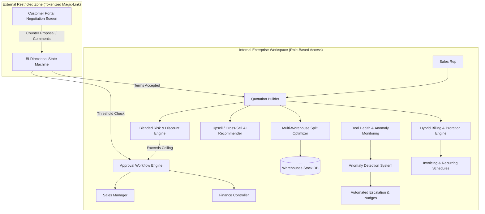
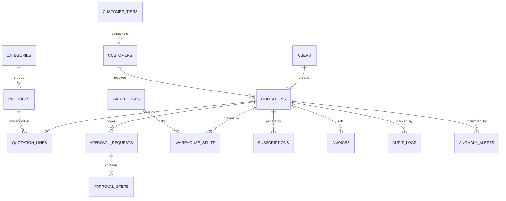

# 🚀 DealFlow360: Intelligent, Self-Governing Sales Operations Platform

An enterprise-grade, high-velocity B2B Sales Operations and Quoting engine built for Odoo Combat / Hackathon.

> **Selected Project:** 🥇 **DealFlow360 (Sales Operations Platform)**  
> **Excalidraw Mockup:** [DealFlow360 Workflow Diagram](https://app.excalidraw.com/l/65VNwvy7c4X/7Fb5SR3WKu2)  
> **Repository:** [malaviyaharsh2003/DealFlow360](https://github.com/malaviyaharsh2003/DealFlow360)

---

## 🌟 Executive Summary & Problem Scope

Most basic sales and quoting tools treat quotations as static PDFs: create a quote, send an email, confirm, and invoice. Real enterprise B2B sales teams operate in chaotic, high-stakes environments characterized by:
1. **Silent Margin Leakage:** Sales reps offer discounts across multiple lines that individually look acceptable but collectively decimate gross margins.
2. **Disconnected Inventory Realities:** Orders confirmed without visibility into multi-warehouse stock allocations, incurring astronomical expedited freight fees and backorder delays.
3. **Billing Fragmentation:** Complex enterprise deals bundling one-time hardware, installation services, and recurring SaaS subscriptions are forced into disconnected billing silos.
4. **Negotiation Latency:** Lengthy email threads over discounts cause buyers to lose momentum and deals to go dark.
5. **Reactive Pipeline Management:** Sales directors only realize deals are stuck or discounted irregularly after missing quarterly revenue targets.

**DealFlow360** eliminates these problems by transforming the quoting process into a **Self-Governing Deal Engine** that dynamically computes blended margin risk, optimizes warehouse fulfillment splits, prorates hybrid billing, facilitates live customer portal negotiation, and detects anomalies in real-time.

---

## 🏛️ System Architecture

---

## 🧮 Deep Analysis: Core Mathematical & Algorithmic Engines

### 1. 🛡️ The Blended Discount Risk Scoring Engine

Traditional software applies naive thresholds (e.g. `order_discount > 10%`). In contrast, DealFlow360 evaluates discounts across **Category Margins** and **Customer Tiers**:

$$\text{Risk Score} = \sum_{i=1}^{n} \left( \frac{\text{LineTotal}_i}{\text{OrderTotal}} \times \max\left(0, \text{Discount}_i - \text{Ceiling}_{c(i), \text{Tier}}\right) \times \gamma_{c(i)} \right)$$

* **Parameters:**
  * $\text{Discount}_i$: Discount applied to line $i$.
  * $\text{Ceiling}_{c(i), \text{Tier}}$: Maximum allowed discount for category $c(i)$ (e.g., Hardware: 15%, Services: 10%) under customer tier (Bronze: 5%, Silver: 10%, Gold: 15%).
  * $\gamma_{c(i)}$: Category risk sensitivity multiplier.
* **Conditional Routing:**
  * $\text{Risk Score} = 0 \implies$ Auto-approved, immediate route to fulfillment.
  * $0 < \text{Risk Score} \le 15 \implies$ Sales Manager review.
  * $\text{Risk Score} > 15 \text{ or single line discount} > 20\% \implies$ Sequential Two-Stage Escalation (**Sales Manager** followed by **Finance Controller**).
* **Immutable Audit Trail:** All reviews, comments, and approvals log user ID, timestamp, and gross margin delta.

---

### 2. 📦 Multi-Warehouse Fulfillment & Backorder Optimization

Orders are automatically evaluated against physical warehouse locations to minimize shipment counts and freight expenses:

$$\min \left( \sum_{j=1}^{M} \mathbb{I}_{[\text{Shipment}_j > 0]} \cdot \text{BaseFreight}_j + \sum_{i=1}^{n} \sum_{j=1}^{M} Q_{ij} \cdot \text{UnitWeightCost}_j \right)$$

$$\text{Subject to: } \sum_{j=1}^{M} Q_{ij} = \text{OrderedQty}_i \quad \forall i, \quad \text{and} \quad Q_{ij} \le \text{AvailableStock}_{ij}$$

* **Dynamic Mid-Fulfillment Consolidation:** If stock replenishes at the primary depot while a backordered line is pending, the system triggers an alert: *"Consolidate Remaining Backorder"* to prevent redundant shipments.

---

### 3. 🔄 Hybrid Billing & Proration Engine

DealFlow360 effortlessly blends **Capex (Hardware)** and **Opex (Recurring SaaS/Services)** on a single quotation:
* **One-Time Lines:** Instant commercial invoice and dispatch manifest generation upon confirmation.
* **Recurring Lines:** Generates automated billing schedules (Monthly, Quarterly, Annual) with configurable start dates.
* **Mid-Cycle Proration:** When seat quantities or plans change mid-cycle:
  $$\text{Adjustment} = (\text{NewMonthlyRate} - \text{OldMonthlyRate}) \times \left( \frac{\text{Days Remaining in Month}}{\text{Total Days in Month}} \right)$$
* **Automated Credit Notes:** Downgrades or cancellations automatically generate credit notes against outstanding customer balances.

---

### 4. 🤖 Real-Time Upsell & Cross-Sell Recommendation Matrix

* **Affinity Matrix:** Derived from co-purchase transaction histories.
* **Promoted Item Weighting:** Boosts priority of strategic products.
* **Gross Margin Floor Guardrail:** Suggestions will **never** surface if adding them reduces the deal's overall margin percentage below the required minimum threshold $\theta_{\text{margin}}$.
* **Live UI Feedback:** Clicking *"Add to Quote"* immediately recalculates total price and margin gauges without page reload.

---

### 5. 🌐 Interactive Customer Negotiation Portal

* **Zero Data Leakage:** Customers authenticate via tokenized magic links. Proprietary cost structures, internal notes, and blended risk scores are completely stripped.
* **Line-Level Discussions:** Threaded commenting on specific line items.
* **Counter-Offer Guardrails:** If the customer counters with a discount breaching policy, the quotation state machine automatically re-locks and pushes the quote back to the internal approval queue.

---

### 6. 🚨 Deal Health & Statistical Anomaly Monitoring

* **Stalled Deal Detection:** Flags deals inactive for $> 7$ days in negotiation stages.
* **Statistical Rep Discount Anomaly ($Z$-Score):**
  $$Z = \frac{\text{Discount}_{\text{quoted}} - \mu_{\text{rep}}}{\sigma_{\text{rep}}}$$
  If $Z \ge 2.0$, a high-severity alert alerts sales management of atypical discounting behavior.
* **Delivery Promise Slippage:** Compares shipping lead time across split warehouses against customer promise dates.

---

## 🏆 Judges' Point-of-View & Hackathon Winning Criteria

| Dimension | Why DealFlow360 Wins Over Other Submissions |
| :--- | :--- |
| **Architectural Depth** | It goes beyond simple UI forms and builds **real mathematical engines** (Blended Risk, Warehouse Optimization, Proration). |
| **Real-World B2B Reality** | Solves true enterprise nightmares: margin erosion, hybrid billing, backorder logistics, and customer negotiation loops. |
| **Role-Based Security** | Complete separation of internal sales workspaces vs. external tokenized customer negotiation portals. |
| **Live Demo "Wow" Factor** | Live two-window demo: Customer proposes a counter discount $\rightarrow$ Manager dashboard instantly flashes red with an automated approval lock! |

---

## 🗄️ Relational Data Schema (ERD)

---

## 🎬 5-Minute High-Impact Live Demo Script

1. **Minute 0:00 - 1:00:** Rep logs in, builds quote for Gold customer with hardware & services. Observes live margin meter.
2. **Minute 1:00 - 1:45:** Rep clicks smart upsell recommendation. Instant margin boost.
3. **Minute 1:45 - 2:30:** Rep applies aggressive discount on services. Blended risk engine triggers 2-stage approval (Manager + Finance). Manager approves with audit trail.
4. **Minute 2:30 - 3:45:** Open Customer Portal in separate window. Customer counters discount. System automatically re-evaluates risk and locks quote for approval.
5. **Minute 3:45 - 5:00:** Terms confirmed. Fulfillment auto-splits between Main Warehouse and East Depot. Split billing generated (hardware invoice + quarterly subscription schedule). Deal health dashboard displays green health score.

---

## 🛠️ Technology Stack Recommendations

* **Backend:** Node.js / Python (FastAPI) or Go (high-concurrency calculation engines).
* **Frontend:** React / Vite / Tailwind CSS / Vanilla CSS with rich animations and micro-interactions.
* **Database:** PostgreSQL / SQLite with strict relational foreign keys and transaction integrity.
* **Authentication:** JWT for internal users; HMAC tokenized magic links for customer portal.
