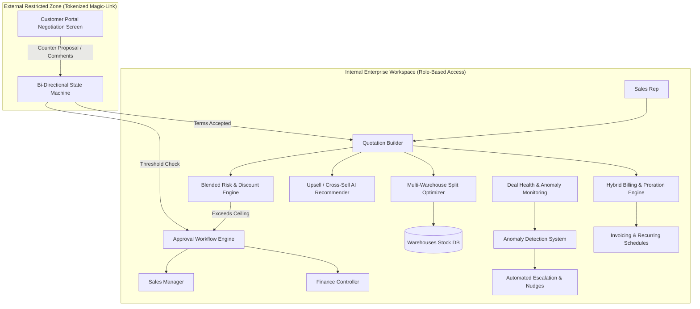
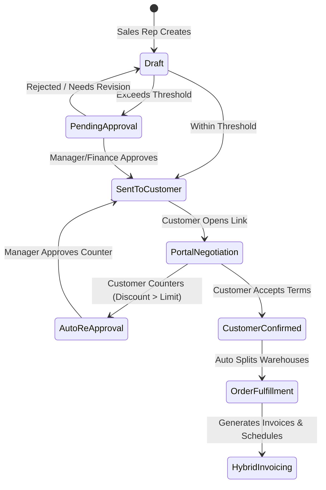
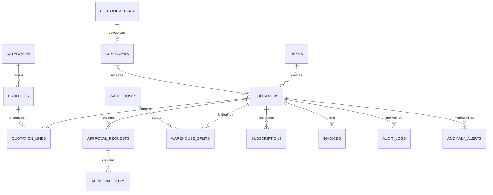

# 🚀 DealFlow360: Master Implementation Plan & System Architecture

An intelligent, self-governing Sales Operations Platform engineering blueprint designed for high-velocity B2B enterprises.

---

## 📌 Executive Summary & Problem Scope

Traditional sales and quoting tools (CPQ) treat quotations as passive, static forms (Quote $\rightarrow$ Order $\rightarrow$ Invoice). In real-world enterprise operations, sales teams struggle with:
1. **Silent Margin Leakage:** Reps subtly over-discount across multiple line items without triggering single-threshold alarms.
2. **Inventory Disconnect:** Orders confirmed without checking physical warehouse distribution, resulting in shipping delays and ballooning freight costs.
3. **Cart Fragmentation:** Hardware, services, and SaaS subscriptions are forced into disparate billing systems.
4. **Negotiation Friction:** Endless back-and-forth emails leading to deal stagnation and lost customer momentum.
5. **Lack of Proactive Governance:** Managers only discover stalled or unprofitable deals at the end of the fiscal quarter.

**DealFlow360** solves this by creating a **Self-Governing Deal Engine** that enforces automated pricing discipline, optimizes multi-warehouse inventory allocation in real-time, reconciles hybrid billing schedules, provides a live external customer negotiation portal, and proactively alerts on deal health anomalies.

---

## 🎯 System Architecture Overview

---

## 🧠 Core Mathematical & Algorithmic Engines

### 1. 🧮 Blended Discount Risk Scoring Engine

Instead of evaluating discounts as a simple order-level percentage, DealFlow360 uses a **Category-Weighted Multi-Attribute Margin Risk Function**:

$$\text{Risk Score} = \sum_{i=1}^{n} \left( \frac{\text{LineTotal}_i}{\text{OrderTotal}} \times \max\left(0, \text{Discount}_i - \text{Ceiling}_{c(i), \text{Tier}}\right) \times \gamma_{c(i)} \right)$$

* Where:
  * $\text{Discount}_i$: Discount applied to line item $i$.
  * $\text{Ceiling}_{c(i), \text{Tier}}$: Maximum allowable discount for category $c(i)$ under customer tier $\text{Tier}$ (e.g., Gold, Silver, Bronze).
  * $\gamma_{c(i)}$: Sensitivity multiplier (e.g., Services with thin margins have $\gamma = 2.0$, Hardware has $\gamma = 1.0$).

#### Routing Rule Matrix:
* **Score = 0:** Auto-approved. Quotation can proceed directly to fulfillment.
* **$0 < \text{Score} \le 15$:** Routed to **Sales Manager** for tier-1 signoff.
* **$\text{Score} > 15$ OR any single line discount violation $> 20\%$:** Sequential 2-tier approval required (**Sales Manager** $\rightarrow$ **Finance Controller**).
* **Audit Trail:** Every approval, rejection, comment, and override is permanently recorded with user ID, timestamp, and margin delta impact.

---

### 2. 📦 Multi-Warehouse Fulfillment & Backorder Optimization Algorithm

When an order is confirmed, inventory must be sourced across $M$ warehouses with minimal shipping splits and lowest freight overhead.

#### Optimization Objective:
$$\min \left( \sum_{j=1}^{M} \mathbb{I}_{[\text{Shipment}_j > 0]} \cdot \text{BaseFreight}_j + \sum_{i=1}^{n} \sum_{j=1}^{M} Q_{ij} \cdot \text{UnitWeightCost}_j \right)$$

$$\text{Subject to: } \sum_{j=1}^{M} Q_{ij} = \text{OrderedQty}_i \quad \forall i, \quad \text{and} \quad Q_{ij} \le \text{AvailableStock}_{ij}$$

* **Automated Backorder Trigger:** If total inventory $\sum \text{Stock} < \text{OrderedQty}$, remaining quantities are split into a tracked `Backorder` batch.
* **Mid-Fulfillment Dynamic Consolidation:** If stock replenishes at the primary hub while a backorder is pending packaging, an event triggers: *"Consolidate Remaining Backorder"* to avoid duplicate courier dispatches.

---

### 3. 🔄 Hybrid Billing & Proration Calculation Engine

A single checkout supports both **Capex** (Physical Products) and **Opex** (Recurring Subscriptions).

#### Proration Engine Logic:
For mid-cycle plan upgrades, downgrades, or seat quantity alterations:

$$\text{Prorated Credit / Charge} = (\text{NewRate} - \text{OldRate}) \times \left( \frac{\text{Days Remaining in Cycle}}{\text{Total Days in Billing Cycle}} \right)$$

* **Invoicing Separation:**
  * One-time hardware items immediately spawn standard commercial invoices and shipping manifests.
  * Recurring items initialize an automated recurring billing ledger with auto-generated billing milestones (Monthly, Quarterly, Annual).
  * Mid-cycle cancellations instantly invoke an automated Credit Note creation flow.

---

### 4. 🤖 Real-Time Upsell & Cross-Sell Recommendation Matrix

During quotation drafting, the panel evaluates the cart contents and computes recommendations:
* **Affinity Score:** Derived from historical co-purchase association rules:
  $$\text{Confidence}(A \Rightarrow B) = \frac{\text{Orders with } A \text{ and } B}{\text{Orders with } A}$$
* **Active Promotion Boost:** Flagged items receive weighted prioritization.
* **Margin Safety Gate:** Items that cause the quotation's overall gross margin percentage to dip below configured target $\theta_{\text{margin}}$ are suppressed.
* **Live UI Delta:** As soon as an item is clicked, the Cart Gross Margin Indicator updates smoothly without full page reloads.

---

### 5. 🌐 Customer Negotiation Portal (Secure State Machine)

External customers access quotes via restricted, stateless tokens without seeing internal margins or manager notes:

* **Line-Level Discussion Threads:** Customer can leave questions directly on specific line items (e.g., *"Can we get 2 extra spares at this price?"*).
* **Counter-Offer Guardrail:** If the customer counters with a discount that breaks the tier ceiling, the quotation state transitions automatically back to `Pending Approval` with a diff view for the manager.

---

### 6. 🚨 Deal Health & Statistical Anomaly Monitoring

DealFlow360 continuously monitors the sales pipeline through 3 active heuristic pipelines:

1. **Stalled Deal Decay:** Quotes remaining in `Sent` or `Negotiation` longer than configured thresholds (e.g. $> 7$ days) are automatically tagged as **Stalled** with automated rep reminder nudges.
2. **Rep-Specific Statistical Discount Anomaly:** Computes the Z-Score of the offered discount relative to the specific rep's historical discounting behavior:
   $$Z = \frac{\text{Discount}_{\text{given}} - \mu_{\text{rep}}}{\sigma_{\text{rep}}}$$
   If $Z \ge 2.0$, an **Anomaly Alert** is surfaced on the Sales Director's dashboard indicating abnormal discounting behavior.
3. **Delivery Slippage Indicator:** Compares warehouse split logistics lead time against the agreed delivery commitment date.

---

## 🗄️ Comprehensive Relational Data Model (ERD)

### Table Specifications:

* `users`: `id`, `name`, `email`, `role` (Admin, Sales Rep, Sales Manager, Finance, Customer).
* `customer_tiers`: `id`, `name` (Bronze, Silver, Gold), `base_discount_ceiling`.
* `categories`: `id`, `name`, `default_margin_target`, `max_discount_cap`, `risk_multiplier`.
* `products`: `id`, `category_id`, `name`, `type` (One-Time, Subscription, Service), `unit_price`, `cost_price`.
* `warehouses`: `id`, `name`, `location_code`, `base_shipping_rate`.
* `warehouse_inventory`: `id`, `warehouse_id`, `product_id`, `quantity_available`, `replenishment_point`.
* `quotations`: `id`, `quotation_number`, `rep_id`, `customer_id`, `status` (Draft, Pending Approval, Sent, Under Negotiation, Confirmed, Cancelled), `total_amount`, `gross_margin_percent`, `blended_risk_score`, `portal_token`.
* `quotation_lines`: `id`, `quotation_id`, `product_id`, `quantity`, `unit_price`, `discount_percent`, `line_total`, `is_upsell`.
* `approval_workflows`: `id`, `quotation_id`, `stage` (Manager, Finance), `status` (Pending, Approved, Rejected), `reviewer_id`, `comments`, `decided_at`.
* `warehouse_splits`: `id`, `quotation_id`, `warehouse_id`, `status` (Allocated, Packed, Shipped, Backordered), `shipping_cost_estimate`.
* `subscriptions`: `id`, `quotation_id`, `billing_cycle` (Monthly, Quarterly, Annual), `start_date`, `next_billing_date`, `prorated_adjustment`.
* `anomaly_alerts`: `id`, `quotation_id`, `type` (Discount Anomaly, Stalled Deal, Delivery Risk), `severity` (Low, Medium, Critical), `resolved`.

---

## 🏆 Hackathon Judges' Winning Angle: Why DealFlow360 Dominates

| Evaluation Criteria | Typical Competitor Submissions | DealFlow360 Winning Edge |
| :--- | :--- | :--- |
| **Business Logic Depth** | Basic UI with fixed discounts and mock checkout. | **Real mathematical scoring:** Blended risk score calculation across category ceilings with multi-tier conditional routing. |
| **Inventory Integration** | Single stock counter with no warehouse realism. | **Algorithmic warehouse fulfillment splitting** with shipping cost weighting and mid-fulfillment backorder consolidation. |
| **Customer Experience** | Static PDF generation or email attachment. | **Live, token-authenticated negotiation portal** with line-item commenting and counter-proposal loop. |
| **Revenue Protection** | Post-facto reporting without proactive controls. | **Statistical anomaly detection** ($Z$-score vs rep history) and stalled deal decay heuristics with 1-click escalations. |
| **Demo Impact** | Click through 3 static screens. | **Live Bi-Directional Demo:** Adjust discount in Customer Portal $\rightarrow$ Watch Manager Dashboard trigger instant red approval lock. |

---

## 📋 5-Minute High-Impact Live Demo Walkthrough Script

1. **Step 1: Quoting & Live Margin Tracking (0:00 - 1:00)**
   - Rep logs in, creates quote for Acme Corp (Gold Tier). Adds Laptops (Hardware) & Installation (Service).
   - Shows live margin bar adjusting smoothly as quantities and discounts are entered.
2. **Step 2: Smart Upsell Acceptance (1:00 - 1:45)**
   - Upsell panel highlights *"Extended Warranty Service"* (Promoted, $+4\%$ margin delta).
   - Rep clicks *"Add to Quote"* $\rightarrow$ Margin percentage instantly improves.
3. **Step 3: Blended Risk Score & Auto-Approval Escalation (1:45 - 2:30)**
   - Rep applies $18\%$ discount on Service (limit is $10\%$). Blended Risk Score recalculates to 28.5.
   - Quotation triggers sequential 2-tier approval (Sales Manager $\rightarrow$ Finance Controller). Manager approves with audit log.
4. **Step 4: Customer Portal Negotiation Live Sync (2:30 - 3:45)**
   - Open Customer Portal link in Incognito browser window.
   - Customer adds comment on Service line: *"Can you do 20%?"* and submits counter-offer.
   - Back on internal app, state switches to `Pending Approval` with visual diff of requested changes.
5. **Step 5: Warehouse Split & Hybrid Invoicing (3:45 - 5:00)**
   - Terms accepted. Order moves to Fulfillment. System displays auto-split: Main Warehouse (4 units) + East Depot (1 unit backordered).
   - Invoicing tab shows split billing: Instant commercial invoice for Hardware + Recurring quarterly billing schedule for Software subscription.
   - Manager opens Deal Health Dashboard showing real-time metrics, anomaly gauges, and audit trails.

---

## 🛠️ Verification & Quality Assurance Plan

### Automated Test Coverage:
* `test_blended_risk_calculation`: Verifies edge cases (single line over-discount vs distributed small over-discounts across categories).
* `test_approval_chain_transitions`: Tests permissions and state machine locks (Sales Manager vs Finance requirements).
* `test_warehouse_split_optimization`: Ensures algorithm selects minimum shipment count and lowest freight cost.
* `test_hybrid_proration`: Validates exact day-count proration formulas for mid-cycle changes.
* `test_customer_portal_security`: Ensures customer tokens cannot access internal costs, margins, or admin endpoints.
